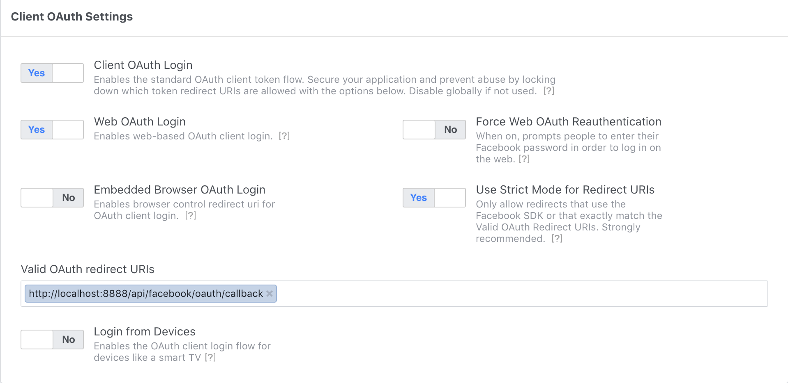

## Facebook OAuth Login Example
Spring-boot demo for facebook oauth login.
Reference by facebook [manually-build-a-login-flow](https://developers.facebook.com/docs/facebook-login/manually-build-a-login-flow).

### Step1. Generate facebook oauth login url
The REST resource of `/api/facebook/user/login` will be generate a facebook oauth login url,
you can pass with `perms` parameter, `perms` means facebook login permissions, can ref [facebook permissions](https://developers.facebook.com/docs/facebook-login/permissions/),

```bash
curl -XGET "http://localhost:8888/api/facebook/user/login?perms=public_profile,email,friends"
```

### Step2. Setting facebook app for oauth redirect uri
when client click the oauth login url, facebook will send a request to `/api/facebook/oauth/callback`,
you must be setting `Valid OAuth redirect URIs` on your facebook app dashboard.


### Step3. Handle facebook oauth login callback
The REST resource of `/api/facebook/oauth/callback` will handle the facebook callback,
You must implement verify `state` parameter to defend dangerous request.
then pass `code` parameter to request facebook user's `access_token`, ref by [Exchanging Code for an Access Token
](https://developers.facebook.com/docs/facebook-login/manually-build-a-login-flow)

### enjoy
English is not my native language; I try my best.

